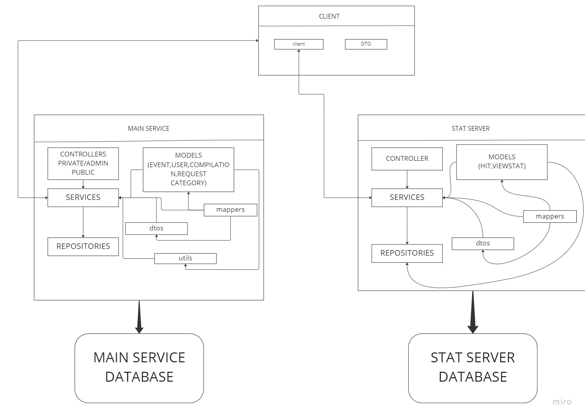
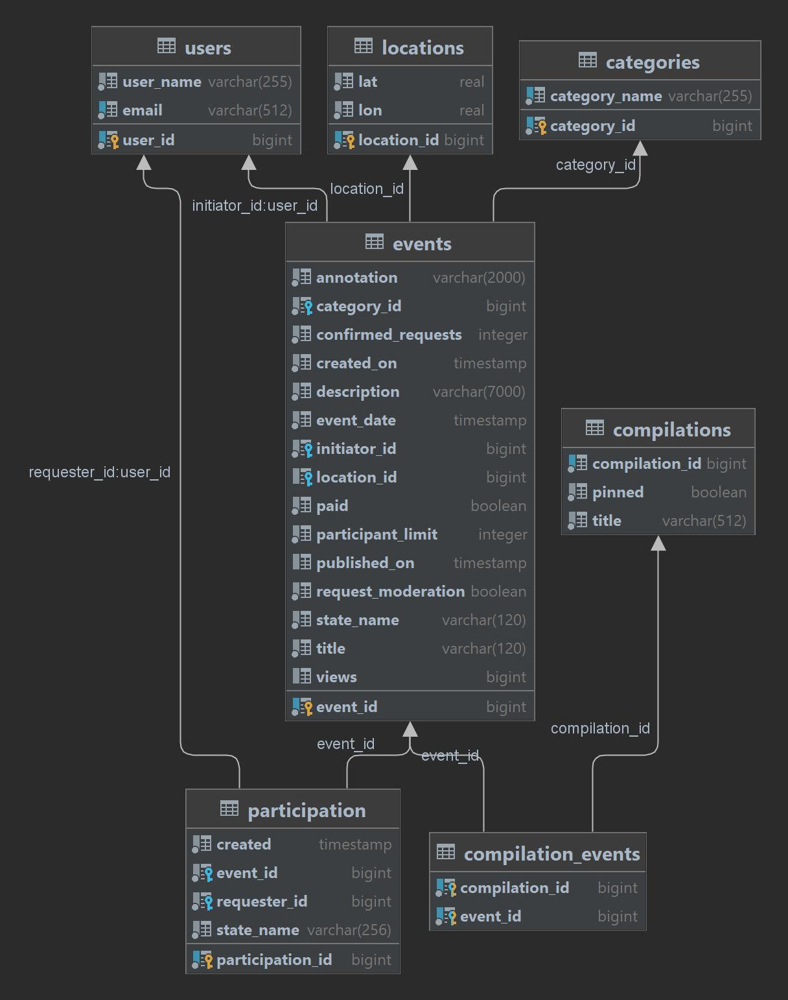
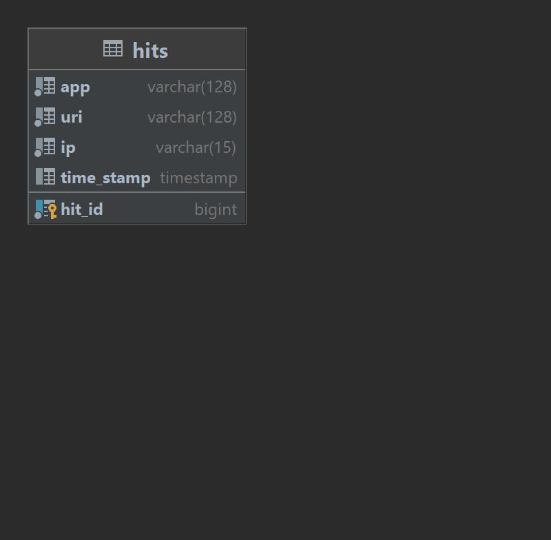

# java-explore-with-me https://github.com/VVish1337/java-explore-with-me/pull/1
--------------------------------------------------------------
Бэкенд для сервиса - афиша, где можно предложить какое-либо событие от выставки до похода в кино и
набрать компанию для участия в нём.

Архитектура приложения.

Главный сервис.

Main-service - содержит всё необходимое для работы продукта. API разделена на три части.

* Публичная - доступна без регистрации любому пользователю сети. Предоставляет возможности поиска и фильтрации событий.
* Закрытая - доступна только авторизованным пользователям. Авторизованные пользователи имеют возможность:
добавлять в приложение новые мероприятия, редактировать их и просматривать после добавления.
работать с заявками на участие в интересующих мероприятиях.
подтверждать заявки, которые отправили другие пользователи сервиса.
* Административная - для администраторов сервиса раззаботана возможность:
добавлять, изменять и удалять категорий для событий.
Добавлять, удалять и закреплять на главной странице подборки мероприятий.
Осуществлять модерацию событий, размещённых пользователями, — публикация или отклонение.
Добавлять, просматривать и удалять пользователей.

Спецификация в Swagger 

Схема базы данных главного сервиса(main-service).

USERS - таблица пользователей
- USER_ID - идентификатор пользователя (первичный ключ).
- USER_NAME - имя пользователя.
- EMAIL - электронная почта.

CATEGORIES - таблица категорий
- CATEGORY_ID - идентификатор категории (первичный ключ).
- CATEGORY_NAME - наименование категории.

LOCATIONS - таблица местоположений событий
- LOCATION_ID - идентификатор локации (первичный ключ).
- LAT - широта.
- LON - долгота.

EVENTS - таблица событий
- EVENT_ID - идентификатор события (первичный ключ).
- ANNOTATION - краткое описание.
- CATEGORY_ID - идентификатор категории (соответствует ID_CATEGORY в таблице CATEGORIES).
- CONFIRMED_REQUESTS - количество принятых заявок для участия в событии.
- DESCRIPTION - полное описание события.
- EVENT_DATE - дата и время на которые намечено событие.
- CREATED_ON - дата и время создания события.
- ID_INITIATOR - идентификатор пользователя (Вторичный ключ соответствует ключу USER_ID в таблице USERS).
- ID_LOCATION - идентификатор локации (Вторичный ключ соответствует ключу LOCATION_ID в таблице LOCATIONS).
- PAID - нужно ли оплачивать участие.
- PUBLISHED_ON - дата и время публикации события.
- PARTICIPANT_LIMIT - ограничение на количество участников. Значение 0 - означает отсутствие ограничения.
- REQUEST_MODERATION - нужна ли пре-модерация заявок на участия.
- STATE_NAME - СОСТОЯНИЕ СОБЫТИЯ (PUBLISHED,PENDING,CANCELLED).
- TITLE - заголовок события.
- VIEWS - количество просмотрев события.

COMPILATIONS - таблица подборок
- COMPILATION_ID - идентификатор подборки событий (первичный ключ).
- PINNED - закреплена ли подборка на главной странице сайта.
- TITLE - заголовок подборки.

COMPILATION_EVENTS - таблица подборок которая содержит в себе события.

- COMPILATION_ID - идентификатор подборки событий (Вторичный ключ соответствует ключу COMPILATION_ID в таблице COMPILATIONS)
- EVENT_ID - идентификатор события (Вторичный ключ соответствует ключу EVENT_ID в таблице EVENTS)

PARTICIPATION

- PARTICIPATION_ID - идентификатор запроса на участие в событии (первичный ключ).
- CREATED - дата и время создания запроса.
- EVENT_ID идентификатор события (Вторичный ключ соответствует ключу соответствует EVENT_ID в таблице EVENTS).
- REQUESTER_ID - идентификатор пользователя (Вторичный ключ соответствует ключу USER_ID в таблице USERS).
- STATE_NAME - статус заявки.

Сервис статистики.

Stat-service — второй сервис, статистики, собирает информацию.
Во-первых, о количестве обращений пользователей к спискам событий и, во-вторых,
о количестве запросов к подробной информации о событии.
- запись информации о том, что был обработан запрос к эндпоинту API.
- предоставление статистики за выбранные даты по выбранному эндпоинту.

Спецификация в Swagger 

Схема базы данных сервиса статистики(Stat-service).

HITS

- HIT_ID - идентификатор записи (первичный ключ).
- APP - идентификатор сервиса для которого записывается информация.
- URI - URI для которого был осуществлен запрос.
- IP - IP-адрес пользователя, осуществившего запрос.
- TIME_STAMP - дата и время, когда был совершен запрос к эндпоинту.